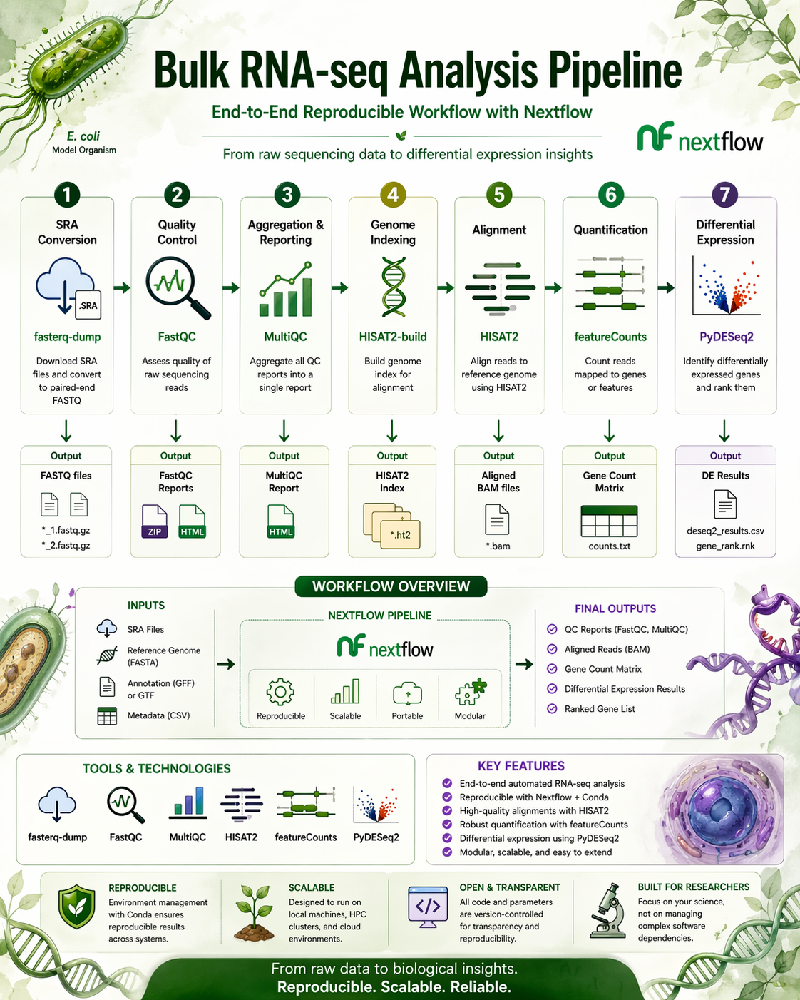

# Bulk RNA-seq Pipeline (Nextflow)

---

## Overview

This repository provides a **reproducible end-to-end bulk RNA-seq analysis pipeline** implemented using Nextflow. The workflow processes raw sequencing data (SRA/FASTQ) through quality control, alignment, quantification, and differential expression analysis.

---

## Workflow

The pipeline performs the following steps:

* SRA Conversion — fasterq-dump
* Quality Control — FastQC
* Aggregation & Reporting — MultiQC
* Genome Indexing — HISAT2-build
* Alignment — HISAT2
* Quantification — featureCounts
* Differential Expression — PyDESeq2



---

## Tools Used

* fasterq-dump
* FastQC
* MultiQC
* HISAT2
* featureCounts
* PyDESeq2

---

## Repository Structure

```
rnaseq-nextflow-pipeline/
│── main.nf
│── nextflow.config
│── metadata.csv
│
├── bin/
│   └── pydeseq2_analysis.py
│
├── conf/
│   └── local.config
│
├── data/
│   └── README.txt
│
├── docs/
│   └── workflow.png
│
└── reference/
    ├── ecoli.fa
    └── GCF_000005845.2_ASM584v2_genomic.gff.gz
```

---

## Requirements

* Nextflow (>= 23.x)
* Java (>= 11)
* Conda (recommended)
* Linux / macOS

---

## Example Data

Expected input structure:

```
data/
  SRR12922090/
    SRR12922090.sra
  SRR12922091/
    SRR12922091.sra
  SRR12922098/
    SRR12922098.sra
```

See:

```
data/README.txt
```

for dataset download instructions.

---

## Usage

```bash
nextflow run main.nf \
  --sra "data/*/*.sra" \
  --genome reference/ecoli.fa \
  --gtf reference/GCF_000005845.2_ASM584v2_genomic.gff.gz \
  --meta metadata.csv
```

---

## Input

* SRA or FASTQ files
* Reference genome (FASTA)
* Gene annotation (GFF/GTF)
* Metadata file (CSV)

---

## Output

* FASTQ files
* FastQC reports
* MultiQC report
* BAM files
* Count matrix
* DE results (`deseq2_results.csv`)
* Ranked genes (`gene_rank.rnk`)

---

## Differential Expression Analysis

Performed using **PyDESeq2**:

* Normalization and dispersion estimation
* Metadata-driven comparisons
* Ranked output for downstream analysis

---

## Reproducibility

* Nextflow workflow management
* Conda-based environments
* Structured, modular pipeline

---

## License

MIT License

---

## Author

K Kiran Kumar
Computational Biology | RNA-seq | Genomics | AI/ML
